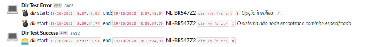
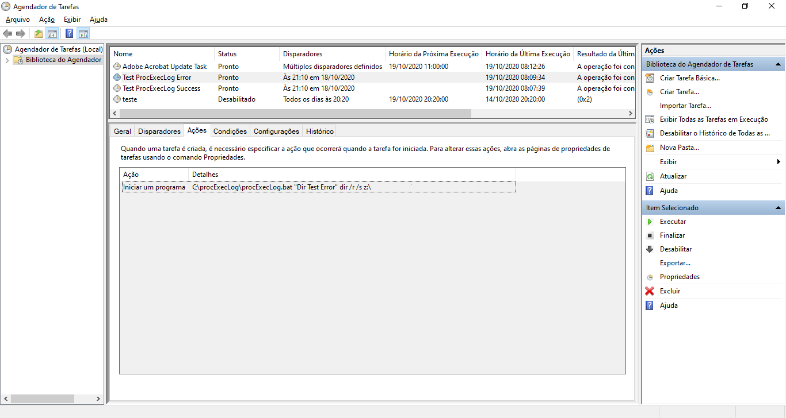
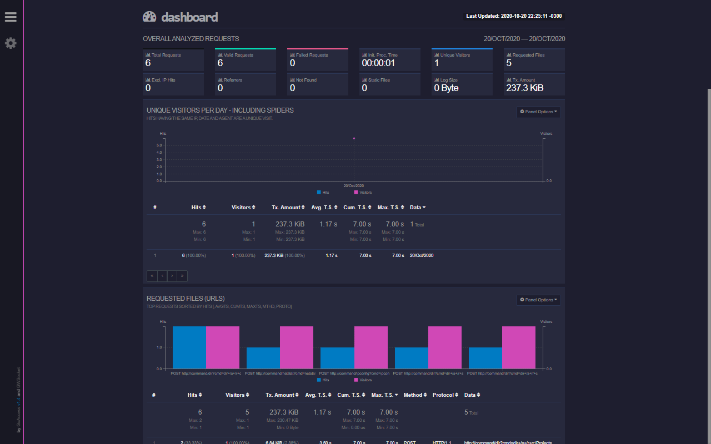

# procExecLog
Run your dos/windows proccess with full traceability

## how to run
```
C:\>c:\Projects\procExecLog\procExecLog.bat "My Description" dir /s /r c:\
127.0.0.1 - U001009 [20/10/2020 22:46:09,59] "POST http://command/dir HTTP/1.1" 200 255000 cmd=dir+/s+/r+c:\ - 255000 "-" "20/10/2020 22:50:24,67 00:04:15,08 SUCCESS 0 "My Description" [dir /s /r c:\] []"
```

## traceability

To full traceability the scrip write log information in this channels:

* log file. `\procExecLog\log\access-20201018.log`
* slack. See session slack config.
* event viewer. Need user permission to write event viewer errors.

## slack config

To sent slack message you need:

* [curl for windows](https://curl.haxx.se/windows/)
    * unpack zipfile in `procExecLog` dir.
    * the script search `curl\bin\curl.exe` in  `procExecLog` dir.
* create the file `config-slack.bat` with the sample: 
    ```bat
    :: slack parameters config

    :: - slack webhook url
    SET SLACK_URL=https://hooks.slack.com/services/FFFFFFFFF/aaaaaaaaa/cccccccccccccccccccccccc
    :: - notification icon
    SET SLACK_ICON=:computer:
    :: - success icon
    SET SLACK_SUCCESS=:sunrise:
    :: - error icon
    SET SLACK_ERROR=:bomb:
    :: - otification channel
    SET SLACK_CHANNEL=#sandbox
    ```

## slack alert sample



## task scheduler config sample



## goaccess report



The log is write with a Common Log Format. Is possible make report with [GoAccess](https://goaccess.io)!

### how to process log

`cat access.log | goaccess --date-format='%d/%m/%Y' --time-format='%H:%M:%S' --log-format='%h %^ %e [%d %t,%^] "%m %U %H" %s %b %q %^ %L %^' >out.html`